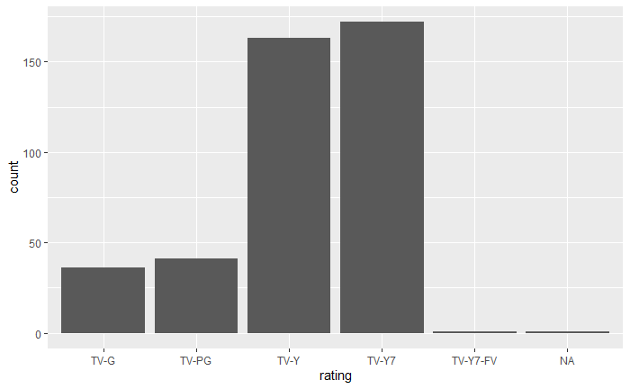

## Quanti prodotti animati ha Netflix

## Anime o cartoni americani?

## Differenza di età consiglita

## Riassumendo

## Date di uscita e di rilascio su netflix

## Date di uscita e di rilascio: anime, cartoni occidentali e live-action

## Gli studi di animazione

## Serie tv contro film

## Serie tv

## Quanto può durare una serie?

## Durata dei film

## Analisi delle piattaforme concorrenti

## Esclusive

## Età consigliata e valutazioni

